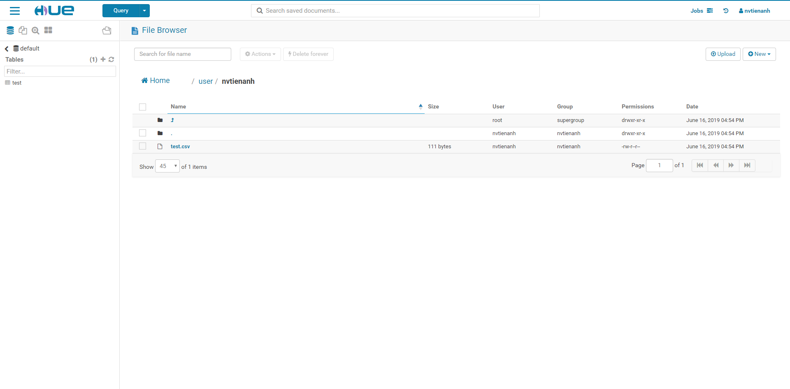

## Sử dụng

Chạy tất cả các container cần thiết:

```
make up
```

Dừng tất cả các contianer đang chạy:

```
make down
```

## Tạo user đăng nhập vào Hue

Truy cập vào LDAP Admin webui url: https://localhost:8888. Tại lần đầu tiên đăng nhập bạn sẽ được yêu cầu tạo tài khoản


Sau khi truy cập xong, bạn có thể thử tính năng **File Browser** để upload 1 file lên


Các tính năng khác các bạn có thể thay đổi trong file pseudo-distributed.ini

## Liên hệ

- Anh Nguyen [@nvtienanh](https://github.com/nvtienanh)
- [nvtienanh.info](https://nvtienanh.info)
